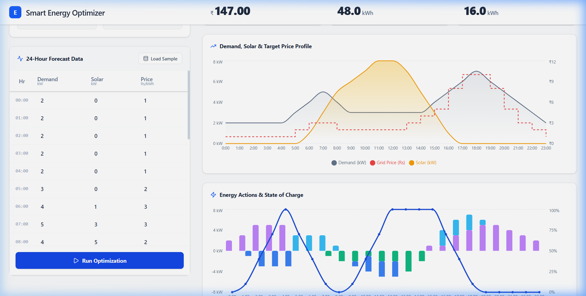

# ⚡ Smart Energy Optimizer

[](docs/preview.png)

Welcome to the **Smart Energy Optimizer** — a comprehensive, enterprise-grade B2B SaaS dashboard built for modern energy management. 

Whether you're managing complex industrial battery systems or just balancing your local solar generation against fluctuating grid prices, this tool gives you absolute control. It runs a heavy-duty Optimization Algorithm under the hood to minimize your daily electricity bills and tells you *exactly* when to charge, discharge, buy, or sell. Best of all? It looks impeccably clean while doing it.

---

## ✨ Features

- **📊 Interactive 24-Hour Forecasting**: Smooth, granular data grids for inputting your expected Demand, Solar Generation, and dynamic Grid Pricing by the hour.
- **🔋 Hardware Constraint Modeling**: Fine-tune the algorithm to your specific setup by defining your Battery Capacity (M) and real-world Max Charge/Discharge Rates (Z).
- **🧠 Automated Optimization Engine**: Powered by a robust Python FastAPI backend that runs dynamic programming logic to calculate your absolute lowest possible daily cost.
- **📈 Beautiful, Actionable Analytics**: See your day planned out visually. Recharts powers overlapping area profiles and exact State of Charge (SOC) tracking so you can see your battery reacting to grid price spikes in real-time.

---

## 🚀 Getting Started

This system is built as a complete full-stack application. You'll need to spin up both the backend (API) and the frontend (UI) for the magic to happen.

### 1. The Backend (Python/FastAPI)

The optimization brain is built with Python. 

1. Ensure you have Python installed. 
2. Install the required packages:
   ```bash
   pip install fastapi uvicorn pydantic
   ```
3. Run the API Server:
   ```bash
   uvicorn main:app --reload
   ```
   *(The API will fire up on `http://127.0.0.1:8000`)*

### 2. The Frontend (React/Vite/Tailwind)

The beautiful UI lives in the `energy-ui` folder.

1. Navigate to the UI directory:
   ```bash
   cd energy-ui
   ```
2. Install the dependencies (Tailwind CSS v4, Recharts, Lucide):
   ```bash
   npm install
   ```
3. Start the development server:
   ```bash
   npm run dev
   ```
   *(The Dashboard will be live at `http://localhost:5173`)*

---

### 💡 How to use the Dashboard
Once both servers are running, head over to your browser. You can manually enter your metrics, or simply hit the **"Load Sample Data"** button to populate a realistic 24-hour scenario. Click **"Run Optimization"** and watch the system calculate your optimal saving strategy in milliseconds!

Built with React, Tailwind, and ❤️.
